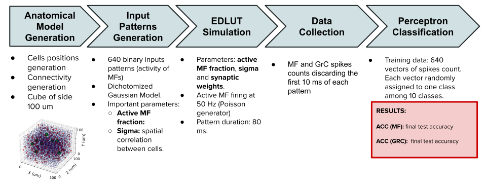

# GRANULAR LAYER ACTIVITY CLASSIFICATION. MODEL PIPELINE
In this project, we present a pipeline to study and classify mossy fibers and granule cells spiking activity. Model pipeline: 

## TABLE OF CONTENTS 

0. [INTRODUCTION](#0-introduction)
1. [ANATOMICAL MODEL GENERATION](#1-anatomical-model-generation)
2. [INPUT PATTERNS GENERATION](#2-input-patterns-generation)
3. [SIMULATIONS](#3-simulations)
4. [PERCEPTRON](#4-perceptron)
5. [VISUALIZATIONS](#5-visualizations)
6. [ARTICLE FIGURES GENERATION](#6-article-figures-generation)

## 0. INTRODUCTION
The project is organised in four main directories: 

- `article_figures` 
- `data`
- `notebooks`
- `results`

Inside the `data` folder, indirect results from the pipeline will be stored that will be needed for the final classification results. 

Inside the `notebooks` folder, you can find 5 main notebooks: 

1. `01_anatomical_model_generation.ipynb`
2. `02_input_patterns_generation.ipynb`
3. `03_simulations.ipynb`
4. `04_perceptron.ipynb`
5. `05_visualizations.ipynb`

These notebooks must be run in the shown order, as it will be detailed in the next sections.  

Inside the `results` folder, the classification results will be stored, as well as some visualizations and plots generated throughout the pipeline steps. 

Inside `article_figures` folder, you will find the implemented code to generate some of the plots from the article figures. Check the last section for more details. 

To run all the project notebooks, you will need to have installed the following libraries: numpy, pandas, scipy, seaborn, sklearn and tensorflow. 

**IMPORTANT**: In order to run the simulations, you will need to install the **EDLUT simulator**. You can find the installation package in the following link: 

https://github.com/EduardoRosLab/edlut

To install it in LINUX, follow the steps shown in `KERNEL/INSTALL_LINUX.bin`.

## 1. ANATOMICAL MODEL GENERATION

This notebook will generate an anatomical model of the cerebellar granular layer using experimental constraints. The main parameters of this notebook are: 

- `seed`: seed for the random generation of the cells positions
- `total_size`: the side size of the volume (cube) that will be generated to position the cells. 

- And the cells populations densities for mossy fibers (MFs), granule cells (GrCs) and Golgi cells (GoCs). It is advised not to modify these last parameters, since they are already known experimental values. 

The main references used are Solinas et al. (2010) (DOI: 10.3389/fncel.2010.00012) and Casali et al. (2019) (DOI: 10.3389/fninf.2019.00037), although our code introduces some adaptations. For instance, in order to avoid possible boundary effects, when connecting neurons, ends of all cube axes were considered as a continuity of their beginnings.

When the notebook is run, information about the cells positions and connectivities is stored in the folder `data/structure`. Visualizations of the anatomical model generated as well as some statistics plots are stored in the folder `results/anatomical_model_visualizations`. 

## 2. INPUT PATTERNS GENERATION

This notebook will generate the input patterns that the mossy fibers will carry. They are created using the using Dichotomized Gaussian model from Macke et al. 2009 (DOI: 10.1162/neco.2008.02-08-713) that provides spatially correlated patterns given specified firing rates and correlations between MFs. The main parameters of this notebook are: 

- `sigma`: Parameter that you will need to set the spatial correlation between MFs.
- `f_mf`: list of MF active fractions that will be used. In our case, it is set from 5% to 95% of MF activity on average. 
- `num_patterns`: number of patterns that will be generated for each pair of sigma and MF active fraction. 

Note that, if you changed the default parameters from the first notebook, `seed` and `total_size`, you need to update them in this second notebook. 

When the notebook is run, the binary input patterns are stored in  `data/input_patterns`. Some input statistics plots are stored in the folder `results/inputs_statistics_visualizations`.

## 3. SIMULATIONS

Once the cells positions and connections, and the inputs of the network are created, the simulations to generate the spiking activity of the cells can be run. As mentioned in the introduction section, you will need to install EDLUT simulator in your computer. The main parameters of this notebook are: 

- `poisson_seed`: poisson generator seed to create MFs spikes. By default, it is initialized to the same seed used for the cells positions generation. 

- `noises`: list of noises fractions. It is the noise that will be introduced in the set of patterns. For each noise fraction, a simulation will be run. 

- `n_seeds`: number of samples presented for each pattern during the simulation. This parameter will be important in the classification when noise fraction differs from zero. If it is zero though, all the presentations of the same pattern will be equal. 

- `duration_pattern`: the duration of each pattern during the simulation in seconds. By default, 80 ms. Active MFs will be spiking at 50 Hz during the pattern duration, while non-active MFs will remain silent. 

- `interval`: duration of time in seconds that will be used to retrieve the spikes count of each cell. By default, 70 ms, meaning that the first 10 ms of the pattern will be discarded. 

The synaptic weights are also important parameters that can be calibrated: 

- `mf_grc_w`: total excitatory weight that reaches each GrC from MFs. With this weight, it has been verified that at least three MFs on average were required to generate spikes in the GrC when spiking close in time to each other.

- `n_mf_grc`: number of MFs connected to each GrC. By default, it is set to 4, since it is the average and it is the number considered when creating the anatomical model. Can be changed to 3, 2, or 1, although it is advised to not change it. 

- `mf_goc_weights`: list of synaptic weights to simulate the excitatory connection from MF to GoC. For each weight, a simulation will be run. 

- `grc_goc_weights`: list of synaptic weights to simulate the excitatory connection from GrC to GoC. For each weight, a simulation will be run.

- `goc_grc_weights`: total inhibitory weight that reaches GrCs from GoCs. It is advised to not increase it, since it can cause errors related to the simulator integration method. Inhibition threshold can be increase or decrease indirectly by changing MF-GoC or GrC-GoC excitatory weights. 

Note that, if you changed the default parameters from the previous notebooks, you need to update them in this one. 

When the notebook is run, a matrix containing activity, i.e. the spikes counts of each cell for the MF and GrC populations, will be stored in  `data/spikes`. 

## 4. PERCEPTRON

This notebook will classify the spiking activity of MFs and GrCs generated in the previous step. It will make use of a single layer perceptron. Each pattern will be randomly assigned to one class among 10 classes and the classification metric studied will be the accuracy. The main parameters of this notebook are: 

- `perceptron_seed`: seed used when splitting the dataset in training, validation and test subsets. By default, it is initialized to the same seed used for the cells positions generation. 

- `num_classes`: total number of classes used for the classification, since the class to which each pattern belongs is randomly assigned. 

- `gamma`: learning rate of the perceptron. 

- `batch_size`: number of training samples utilized in one forward and backward pass during the training process.

- `N_epochs`: number of training epochs for the perceptron. 

Note again that, if you changed the default parameters from the previous notebooks, you need to update them in this one. 

The accuracy results of the classification for mF and GrC, and each combination of parameters will be saved in a file given by the time of generation in the following format: 

- 'train_%m_%d_%Y_%H_%M_%S.csv'
- 'val_%m_%d_%Y_%H_%M_%S.csv'
- 'test_%m_%d_%Y_%H_%M_%S.csv'

The parameters associated to the file as well as its name will be saved in a file called params_file.csv, stored in the folder `results/accuracies`. 

## 5. VISUALIZATIONS 

This notebook provides the code to visualize the accuracy results from the previous step. The main parameter of this notebook is: 

- `comb_weights`: list of combinations of weights MF-GoC and GrC-GoC to be plotted. For instance, if one wants to plot results for: w(MF-GoC) = 0.1, and w(Grc-GoC) = 0.005 and w(Grc-GoC) = 0.015, the list should be set as follows: [[0.1, 0.005], [0.1, 0.015]].

Note again that, if you changed the default parameters from the previous notebooks, you need to update them in this one. 

The plots generated are the the training and test accuracy results for each MF active fraction, as well as the test accuracy results versus the average neuron firing rate calculated in Hz. These three plots will be stored in `results/plots`. 

## 6. ARTICLE FIGURES GENERATION 

 Lastly, in the folder `article_figures` you will find the code to plot some of the figures from the article. This folder is organised again in three subdirectories: 

 - `notebooks`: with the notebooks to generate the figures plots.
 - `data`: with scripts `.py` associated to each notebook, when needed.
 - `results`: where the plots are saved.

For further information or any encountered issue, please don't hesitate to contact María Tirado at mariatirado at ugr dot es (mariatirado@ugr.es).

